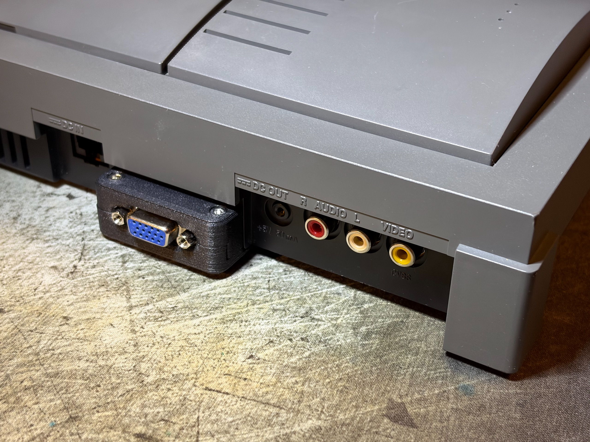

# HD15 Port Add-on for Phlips CD-i

## Introduction

The Philips CD-i can be modded with RGB output. However the actual output port sometimes involve cutting big holes or removing the Composite Video jack to fit. Therefore, I have come up this addon to fit an HD15 port onto the grills on the back of the console.

## Pin Definition

The pin definition follows the standard of my [VGA Dongle Series](https://github.com/jeffqchen/Console-VGA-Dongle-Series), which carries RGBS plus stereo audio.

- Pin 1-3: RGB signals
- Pin 13: HSync/CSync (connect to `CS-TTL` or `CS-75`)
- Pin 14: VSync (normally unpopulated)
- Pin 5, 6-8, 10: Ground
- Pin 12 & 15: Audio L & R
- Pin 9: Fused 5V

## Compatibility

This VGA signal is compatible with all major scalers.
- RetroTINK 5X - with my [dock](https://github.com/jeffqchen/RetroTINK-5X-SCART-Dock)
- RetroTINK 4K - directly connect to the HD15 port or through my [SCART2VGA adapter](https://github.com/jeffqchen/RetroTINK-4K-SCART2VGA-Adapter))
- OSSC - directly connect to AV3 (VGA) port **IF** `CS_TTL` is connected to `Pin 13`
- GBSControl

## Currently supported Models
- CD-i 450 & 550 - [Guide](./450%20%26%20550/README.md)

-----------

Shield: [![CC BY-SA 4.0][cc-by-sa-shield]][cc-by-sa]

This work is licensed under a
[Creative Commons Attribution-ShareAlike 4.0 International License][cc-by-sa].

[![CC BY-SA 4.0][cc-by-sa-image]][cc-by-sa]

[cc-by-sa]: http://creativecommons.org/licenses/by-sa/4.0/
[cc-by-sa-image]: https://licensebuttons.net/l/by-sa/4.0/88x31.png
[cc-by-sa-shield]: https://img.shields.io/badge/License-CC%20BY--SA%204.0-lightgrey.svg
